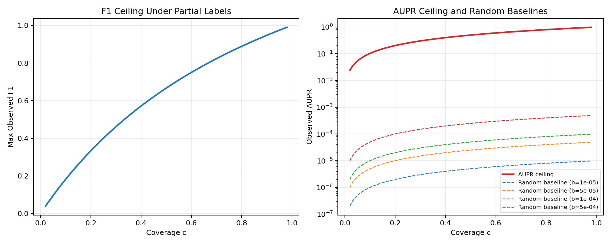
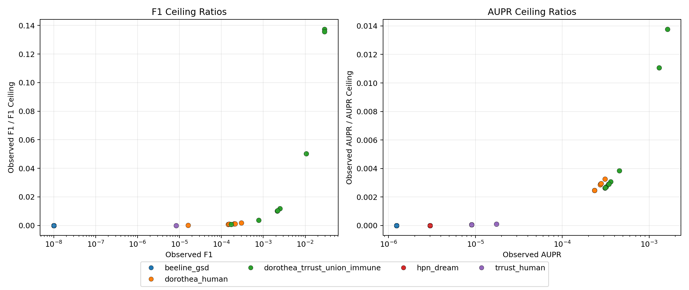
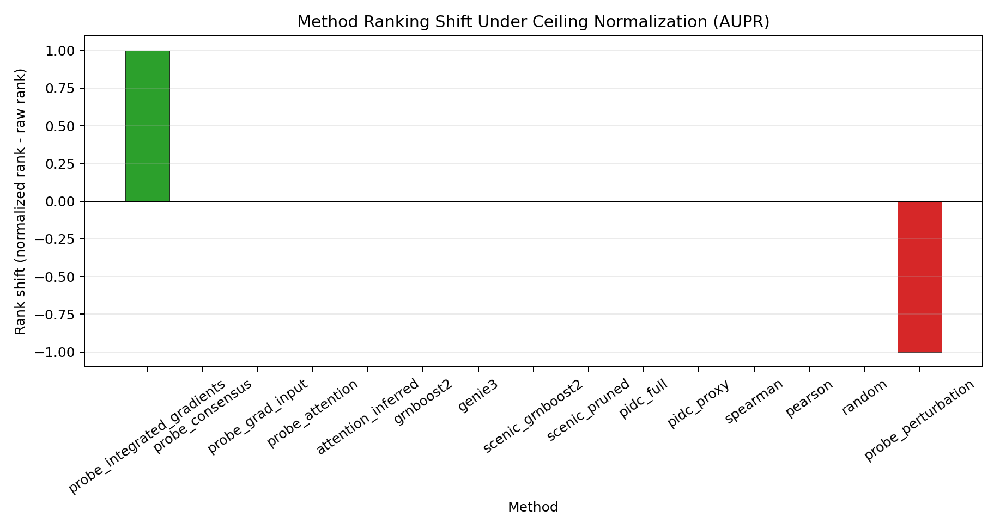
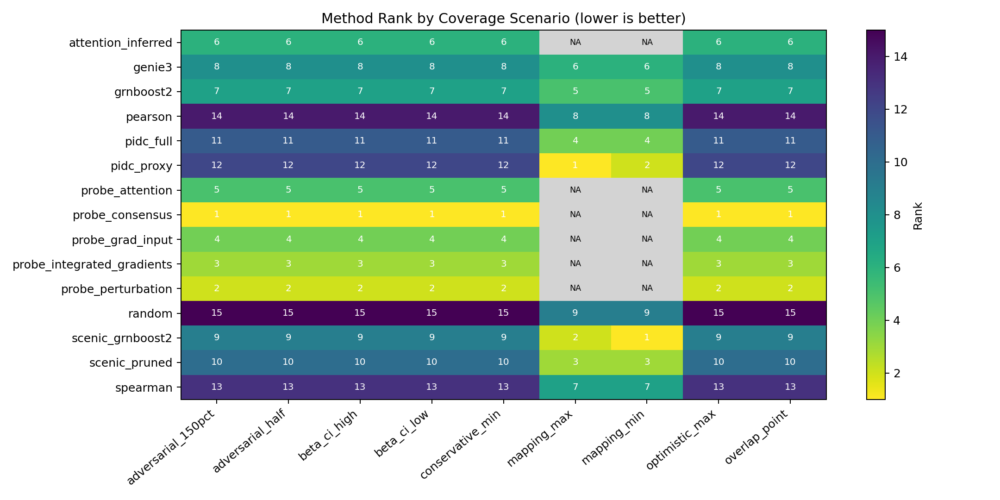
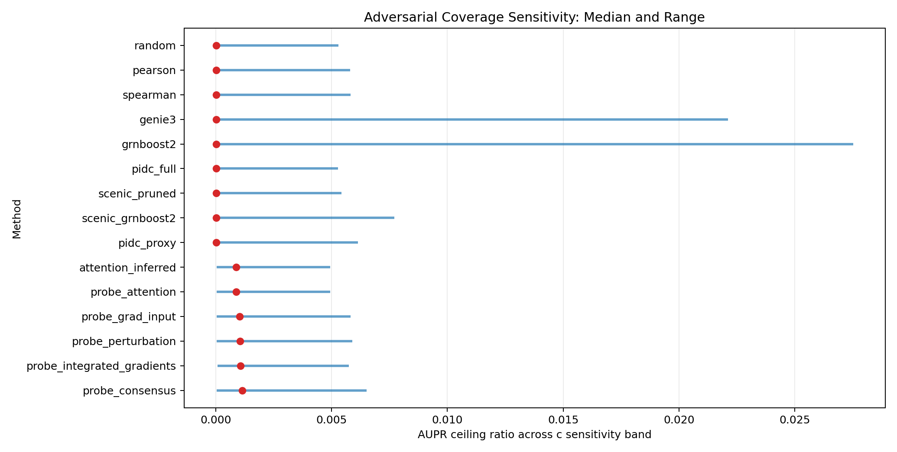
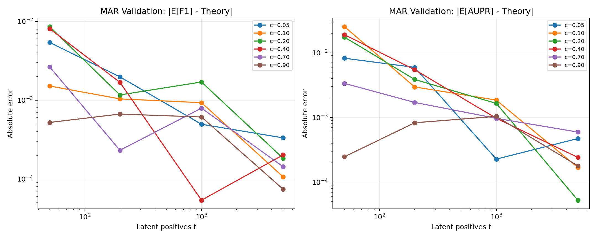
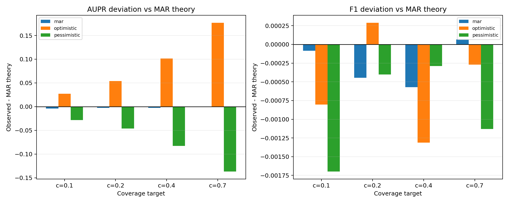

# Partial-Label Metric Ceilings for GRN Evaluation in Single-Cell Foundation Model Benchmarks

## Abstract
Gene regulatory network (GRN) metrics are often interpreted as direct indicators of biological recovery quality, but curated reference networks are incomplete and context-dependent. We develop a theory-first, low-compute framework for interpreting observed precision/F1/AUPR under partial positive labels and then apply it to existing benchmark outputs in this repository. Under a missing-at-random (MAR) positive-label model, we derive explicit ceilings for observed F1 and AUPR as functions of label coverage `c`, propagate uncertainty in `c`, and stress-test assumption violations with adversarial non-MAR simulations. Across 39 AUPR-evaluable rows (15 methods, 5 references), best ceiling-normalized performance remains limited (best F1 ratio 0.137, best AUPR ratio 0.0138; median AUPR ratio 5.56e-05). Only 3/39 evaluations are above their observed random baseline. The biological interpretation is that low absolute scores are not explained by missing labels alone: after accounting for label incompleteness, substantial model-to-biology mismatch remains, and this mismatch is reference-dependent. We provide a ceiling-aware reporting protocol that reduces both overclaiming and underclaiming in mechanistic GRN studies.

## 1. Introduction
Foundation-model-based single-cell analyses are increasingly used to propose regulatory interactions [1]. However, evaluating inferred edges against curated resources remains difficult because reference networks are incomplete, biased toward well-studied pathways, and not always matched to tissue context [3,4,7]. In practice, reported AUPR/F1 values conflate at least two effects:
1. **Observation limits** from partial positive labels.
2. **Model headroom** from ranking and calibration quality.

This study asks: *what observed metric values are theoretically achievable when labels are incomplete, and how should current results be interpreted relative to those ceilings?*

This paper contributes:
1. A formal metric-ceiling framework for partial labels.
2. An empirical reinterpretation over existing benchmark artifacts.
3. Adversarial tests for coverage misspecification and non-MAR labeling.
4. Biological interpretation of what the results imply for GRN claims in single-cell settings.

## 2. Biological and Methodological Context
We evaluate predictions generated from single-cell data (Tabula Sapiens context) [2] and compare against references including TRRUST v2 [3], DoRothEA-derived resources [4], and additional benchmark artifacts in this repository. Baseline methods include tree-based and correlation models commonly used in GRN inference [5,6,7].

Two biological realities motivate this study:
1. **Regulation is context-specific.** TF-target interactions are cell-state and tissue dependent [2,4]. A cross-context reference can systematically miss true context-active edges.
2. **Reference curation is biased.** Canonical or well-studied edges are preferentially represented, so observed labels are not a random sample of latent truth [3,4,9].

These realities mean that raw benchmark metrics should not be read as absolute biological validity.

## 3. Theory
Let:
- `U`: candidate edge universe.
- `T subset U`: latent true positives.
- `L+ subset T`: observed positives.
- `c = P(e in L+ | e in T)`: positive-label coverage.
- `P`: predicted positive edges.

Define latent and observed metrics:
- `Prec_lat = |P intersect T| / |P|`, `Rec_lat = |P intersect T| / |T|`.
- `Prec_obs = |P intersect L+| / |P|`, `Rec_obs = |P intersect L+| / |L+|`.

### 3.1 Proposition 1 (Observed-latent relation under MAR)
If each latent positive is observed independently with probability `c` (MAR assumption):
- `E[Prec_obs] = c * Prec_lat`
- `E[Rec_obs] = Rec_lat`

So latent precision can be approximated by `Prec_obs / c` when `c` is estimated.

### 3.2 Proposition 2 (Observed F1 ceiling)
For an ideal latent predictor (`Prec_lat = Rec_lat = 1`):
- `F1_obs,max(c) = 2c / (1 + c)`.

### 3.3 Proposition 3 (Observed AUPR ceiling)
For latent positive count `t = |T|` under ideal latent ranking:
- `AUPR_obs,max(c,t) ~= c + (1-c) * H_t/t`
where `H_t` is harmonic. For large `t`, `AUPR_obs,max ~= c`.

Observed random baseline under partial labels:
- `AUPR_rand,obs = c * b`, where `b = |T|/|U|`.

We report headroom-aware uplift:
- `rho_aupr = (AUPR_obs - AUPR_rand,obs) / (AUPR_obs,max - AUPR_rand,obs)`.

## 4. Data, Coverage Proxies, and Analysis Design
### 4.1 Empirical inputs
Primary AUPR/F1 tables:
- `data/score_eval_probe_priors.csv`
- `data/score_eval_grn_baselines_immune.csv`

Additional F1-only tables:
- `data/score_eval_probe_priors_full_genes.csv`
- `data/score_eval_probe_priors_full_genes_crosswalk.csv`
- `data/score_eval_probe_priors_full_genes_omnipath.csv`

Coverage proxy reports:
- `data/score_eval_probe_priors_missing_report.json`
- `data/score_eval_probe_priors_full_genes_missing_report.json`
- `data/score_eval_probe_priors_full_genes_crosswalk_missing_report.json`
- `data/score_eval_probe_priors_full_genes_omnipath_missing_report.json`

### 4.2 Coverage estimation and uncertainty
Central coverage is overlap-based (`ref_node_overlap_pct/100`) from primary AUPR-capable tables. We model uncertainty with:
- `c ~ Beta(k+1, n-k+1)` where `k=overlap_nodes`, `n=ref_nodes`.

### 4.3 Adversarial scenarios
Per reference, we evaluate:
- `overlap_point`, `beta_ci_low`, `beta_ci_high`
- misspecification stress: `0.5x`, `1.5x`
- mapping-derived bounds: `mapping_min`, `mapping_max`
- envelope: `conservative_min`, `optimistic_max`

### 4.4 Synthetic validation
We run:
1. MAR simulations over `c in {0.05,0.1,0.2,0.4,0.7,0.9}` and `t in {50,200,1000,5000}`.
2. Non-MAR simulations where observed labels are rank-biased (optimistic/pessimistic) but keep similar average coverage.

## 5. Results

### 5.1 Global reinterpretation: missing labels are not the full story
From `central_aupr_rows.csv`:
- AUPR-evaluable rows: 39
- methods: 15
- references: 5
- best F1 ratio: 0.137393 (`genie3`, `dorothea_trrust_union_immune`)
- best AUPR ratio: 0.013771 (`grnboost2`, `dorothea_trrust_union_immune`)
- median F1 ratio: 0.0
- median AUPR ratio: 5.56e-05

Interpretation: even after accounting for incomplete labels, observed metrics are a small fraction of their theoretical observable headroom. This indicates a **model-limited regime**, not merely a **label-limited regime**.

**Evidence:** median AUPR ceiling ratio is `5.56e-05` and best ratio is `0.013771`.
**Inference:** most methods capture only a tiny fraction of currently observable benchmark signal.
**Hypothesis:** current scoring signals are dominated by non-regulatory covariance patterns.
**Scientific implication:** benchmark improvement should prioritize biological signal modeling, not only candidate/mapping adjustments.

### 5.2 Biological interpretation by reference regime
Reference-level medians show two distinct regimes:

1. **Low-coverage transcriptional references** (`dorothea_human`, `dorothea_trrust_union_immune`, `trrust_human`):
- `c` ranges ~0.095 to 0.159.
- AUPR ratios are still low (median ~0.0029 for DoRothEA-based references; ~5.6e-05 for TRRUST).

Biological meaning: low overlap is consistent with context mismatch and curation scope differences across tissues/states [2,4]. But ratios remain low even after coverage correction, so incompleteness alone cannot explain weak recovery.

2. **High-coverage references** (`hpn_dream`, `beeline_gsd`, central `c` ~0.745 and ~0.882):
- Near-zero F1 and tiny AUPR ratios persist.

Biological meaning: when node overlap is high but ranking quality remains near-null, the bottleneck is likely signal-model mismatch (e.g., expression-derived scores vs pathway/causal signaling structure) rather than symbol overlap.

**Evidence:** high-overlap references (`hpn_dream`, `beeline_gsd`) still show near-zero F1 and very small AUPR ratios.
**Inference:** overlap coverage alone does not rescue predictive utility.
**Hypothesis:** pathway-level causal structure in these references is not well represented by the evaluated score families.
**Scientific implication:** report results by biological reference type and avoid pooled claims across incompatible regulatory layers.

### 5.3 Most evaluations are below random baseline
`36/39` rows have `AUPR_obs < AUPR_rand,obs` (negative uplift). Only three rows are positive uplift:
- `grnboost2` on `dorothea_trrust_union_immune` (`rho_aupr` = 0.009786)
- `genie3` on `dorothea_trrust_union_immune` (`rho_aupr` = 0.007064)
- `probe_integrated_gradients` on `trrust_human` (`rho_aupr` = 2.27e-05)

Biological meaning: most evaluated edge rankings are not meaningfully enriched for reference edges beyond random expectation in this setup, even after accounting for partial labels.

**Evidence:** `36/39` rows have negative uplift (`AUPR_obs < c*b`).
**Inference:** most reported rankings are below observed-baseline utility in this protocol.
**Hypothesis:** thresholding/top-k policies are amplifying noisy edges faster than true regulatory signal.
**Scientific implication:** downstream wet-lab prioritization should be conservative unless uplift is positive and robust.

### 5.4 Method ordering and what it means biologically
Ceiling normalization causes only small central-scenario reordering (one local swap: `probe_perturbation` vs `probe_integrated_gradients`). This indicates that in this dataset the dominant issue is not between-method relative ordering; it is the overall distance of all methods from the estimated biological headroom.

**Evidence:** only one adjacent rank swap appears under central normalization.
**Inference:** relative method ordering is comparatively stable in the central coverage regime.
**Hypothesis:** methods share similar error modes on the evaluated references.
**Scientific implication:** scientific conclusions should focus on absolute headroom deficit, not marginal leaderboard swaps.

### 5.5 Adversarial coverage analysis reveals proxy fragility
Overlap/Beta scaling scenarios preserve ranks (Spearman ~1), but mapping-driven scenarios (`mapping_min/max`) produce large shifts (up to 10-11 rank positions on overlapping subsets).

Biological meaning: symbol normalization and curation identity handling can dominate conclusions in sparse-overlap settings. Reported method superiority can be a mapping artifact if coverage assumptions are implicit.

**Evidence:** mapping-based scenarios shift subset ranks by up to 10-11 positions.
**Inference:** coverage proxy choice can be a first-order source of benchmark volatility.
**Hypothesis:** alias/identifier ambiguities are concentrated in biologically central genes, disproportionately affecting evaluation.
**Scientific implication:** manuscripts must publish mapping policy, ambiguity handling, and sensitivity bands as primary results.

### 5.6 MAR formulas are accurate under MAR, but non-MAR bias is substantial
MAR validation shows low bias:
- median absolute F1 bias: 7.30e-04
- median absolute AUPR bias: 1.35e-03

Under non-MAR labeling:
- optimistic (high-ranked edges more likely labeled): mean AUPR delta +0.0898
- pessimistic: mean AUPR delta -0.0734

Biological meaning: if curated references overrepresent canonical, easy-to-detect biology, benchmark AUPR can be inflated; if they underrepresent such edges, AUPR can be deflated. This is exactly the curation-bias channel expected in knowledge-driven resources [3,4,9].

**Evidence:** MAR bias is small, but non-MAR simulations shift mean AUPR by about `+0.0898` (optimistic) or `-0.0734` (pessimistic).
**Inference:** curation mechanism, not just coverage magnitude, can change apparent model quality.
**Hypothesis:** literature-curated resources over-sample pathway-prominent interactions and under-sample context-specific weak-effect regulation.
**Scientific implication:** non-MAR stress tests should be required before making comparative biological claims.

## 6. Discussion
This study suggests the following biological interpretation of current GRN benchmark behavior:

1. **Low overlap is real but not sufficient as an explanation.**
Coverage-corrected ratios remain very low for most settings, so poor scores are not only a gold-standard incompleteness artifact.

2. **Reference choice encodes biological assumptions.**
Different references represent different layers of biology (TF-target transcriptional control vs pathway/signal-level interactions). Method performance should be interpreted in that layer-specific context, not pooled uncritically.

3. **Most inferred edges should be treated as exploratory hypotheses.**
Given near-random or below-random uplift in most rows, these outputs are currently better suited for triage and follow-up than for strong mechanistic claims.

4. **Curation bias can move conclusions in both directions.**
Non-MAR simulations show large AUPR shifts without any change in latent predictor quality. Benchmarks that ignore this are vulnerable to overclaiming and underclaiming.

### 6.1 Evidence -> Inference -> Hypothesis examples
1. **Evidence:** `36/39` AUPR rows are below the observed random baseline (`AUPR_obs < c*b`), and median normalized uplift is slightly negative.
   **Inference:** most evaluated ranking functions do not yet enrich true regulatory edges beyond baseline expectation under the current protocol.
   **Hypothesis:** the dominant signal used by these models is capturing broad co-expression or abundance structure rather than directional regulatory control.
2. **Evidence:** strong performance concentration appears mainly in `dorothea_trrust_union_immune` for tree-based baselines, while other references remain near-null.
   **Inference:** method success is reference-dependent and likely tied to compatibility between scoring assumptions and reference construction.
   **Hypothesis:** references emphasizing canonical TF programs reward methods aligned with known high-variance transcriptional modules.
3. **Evidence:** non-MAR perturbations swing mean AUPR by approximately +0.09 (optimistic labeling) or -0.07 (pessimistic labeling).
   **Inference:** benchmark outcomes are highly sensitive to which true edges are likely to be curated.
   **Hypothesis:** current curated resources over-sample pathway-prominent or assay-accessible interactions, distorting apparent model quality in both directions.

## 7. Practical Recommendations for Biological FM Papers
We recommend a mandatory reporting protocol:
1. Report raw metrics and ceiling-normalized metrics together.
2. Report explicit coverage proxy definition and uncertainty interval.
3. Report observed baseline (`c*b`) and uplift (`rho_aupr`).
4. Include at least one non-MAR stress test.
5. Separate claims by biological layer of the reference (transcriptional vs signaling).
6. Treat edges as high-confidence only when they are robust across references/scenarios and show positive uplift.

## 8. Limitations
- Coverage `c` is proxy-estimated, not identifiable.
- Results are conditioned on existing artifacts and candidate-set definitions.
- Non-MAR simulations are stylized; they show sensitivity, not exact real-world bias magnitude.
- Biological interpretation remains benchmark-centric and does not replace perturbational validation.

## 9. Conclusion
Partial-label ceilings are necessary for interpreting GRN benchmarks but not sufficient for vindicating weak performance. In this dataset, label incompleteness explains part of the story; substantial model-to-biology mismatch remains after correction. The main value of this framework is not to inflate performance claims, but to make benchmark interpretations honest, uncertainty-aware, and biologically contextualized.

## 10. Reproducibility and Artifacts
Run:

```bash
python scripts/run_paper_pipeline.py
python scripts/build_final_paper_markdown.py
```

Core outputs:
- Tables: `outputs/paper/tables/`
- Figures: `outputs/paper/figures/`

Figures:









## References
[1] Cui, H., Wang, C., Maan, H., et al. *scGPT: toward building a foundation model for single-cell multi-omics using generative AI*. Nature Methods (2024). https://doi.org/10.1038/s41592-024-02201-0

[2] The Tabula Sapiens Consortium. *The Tabula Sapiens: A multiple-organ, single-cell transcriptomic atlas of humans*. Science 376(6594):eabl4896 (2022). https://doi.org/10.1126/science.abl4896

[3] Han, H., Cho, J.-W., Lee, S., et al. *TRRUST v2: an expanded reference database of human and mouse transcriptional regulatory interactions*. Nucleic Acids Research 46(D1):D380-D386 (2018). https://doi.org/10.1093/nar/gkx1013

[4] Garcia-Alonso, L., Holland, C.H., Ibrahim, M.M., Turei, D., Saez-Rodriguez, J. *Benchmark and integration of resources for the estimation of human transcription factor activities*. Genome Research 29(8):1363-1375 (2019). https://doi.org/10.1101/gr.240663.118

[5] Huynh-Thu, V.A., Irrthum, A., Wehenkel, L., Geurts, P. *Inferring regulatory networks from expression data using tree-based methods*. PLOS ONE 5(9):e12776 (2010). https://doi.org/10.1371/journal.pone.0012776

[6] Moerman, T., Aibar, S., Gonzalez-Blas, C.B., et al. *GRNBoost2 and Arboreto: efficient and scalable inference of gene regulatory networks*. Bioinformatics 35(12):2159-2161 (2019). https://doi.org/10.1093/bioinformatics/bty916

[7] Pratapa, A., Jalihal, A.P., Law, J.N., Bharadwaj, A., Murali, T.M. *Benchmarking algorithms for gene regulatory network inference from single-cell transcriptomic data*. Nature Methods 17:147-154 (2020). https://doi.org/10.1038/s41592-019-0690-6

[8] Saito, T., Rehmsmeier, M. *The precision-recall plot is more informative than the ROC plot when evaluating binary classifiers on imbalanced datasets*. PLOS ONE 10(3):e0118432 (2015). https://doi.org/10.1371/journal.pone.0118432

[9] Cerulo, L., Elkan, C., Ceccarelli, M. *Learning gene regulatory networks from only positive and unlabeled data*. BMC Bioinformatics 11:228 (2010). https://doi.org/10.1186/1471-2105-11-228

[10] Elkan, C., Noto, K. *Learning classifiers from only positive and unlabeled data*. KDD (2008).
